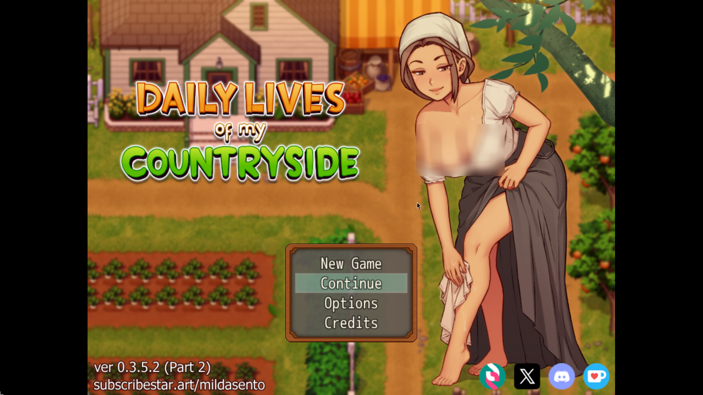
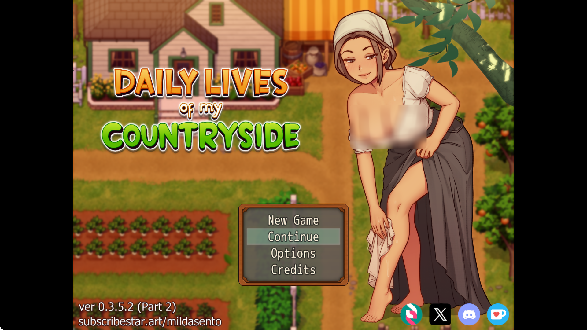
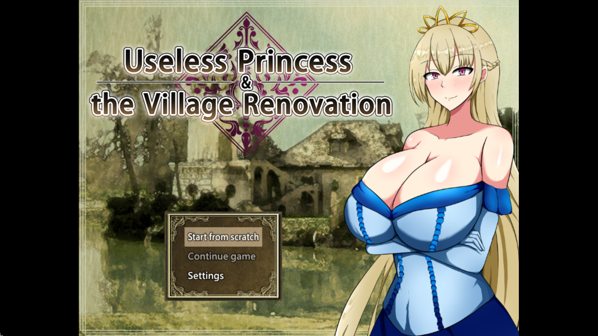
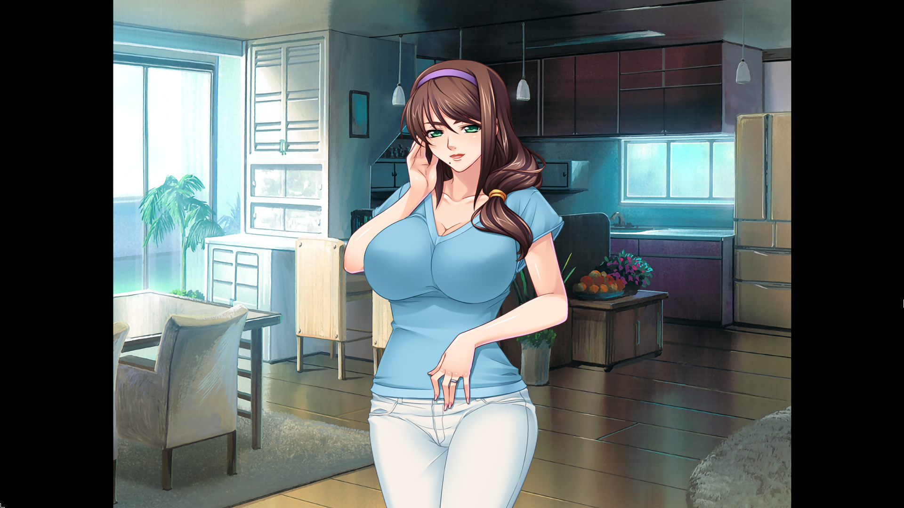
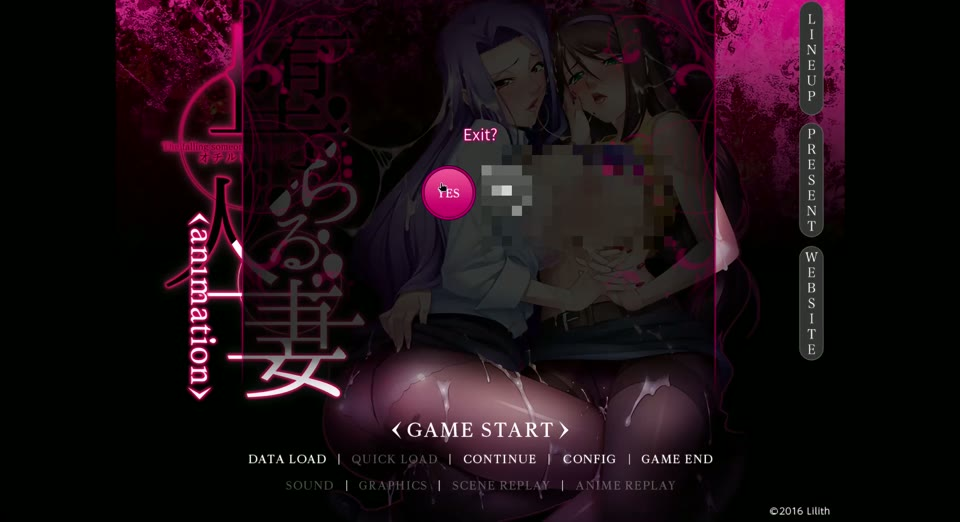

# anime4k-restore-linux

Anime4K **Restore** CNN filters on Linux — the Magpie-on-Windows look
(game at full resolution, restoration filter on top), without upscaling,
capture tricks, or a compositor in the middle. Each game renders normally;
the filter processes every presented frame through the vkBasalt Vulkan layer.

Five Restore variants ship: **S, M, L, Soft_S, Soft_L**
(S light … L strong; Soft tuned for aliased or downscaled art).

## Origin

This is a toy project 100% vibecoded with Muse Spark 1.3 free, made for
personal use first.

## Gallery (Restore L, 1080p)

| Daily Lives of My Countryside (RPGMaker) | |
|---|---|
|  |  |
| off | **Restore L** |

| Useless Princess & the Village Renovation (RPGMaker) | |
|---|---|
|  |  |
| off | **Restore L** |

| Ochiru Hitozuma (KiriKiri/Proton) | |
|---|---|
|  |  |
| off | **Restore L** |

## Usage example with comparison

[](https://darkiu1337.github.io/anime4k-restore-linux/docs/assets/usage.mp4)

*Usage demo — filtered gameplay (Restore L).*

Look for cleaner line art, calmer gradients, and less compression noise —
that is the whole effect. Nothing is upscaled; resolution never changes.

## Capabilities

* **Three runners**: Proton/Windows games (D3D9–12, Vulkan), RPGMaker
  folders (MV/MZ filtered; other engines redirect), native Linux
  executables (Vulkan direct, OpenGL via Zink).
* **Per-game library** (TUI + Qt GUI sharing one JSON store): variant,
  GPU, fps cap, overlay, locale, prefix mode.
* **Game detection**: engine sniffing pre-selects the runner.
* **Frame caps everywhere**: DXVK on Proton, MangoHud elsewhere; optional
  overlay readout.
* **A/B comparison**: unfiltered launches structurally exclude the layer.
* **Wine prefixes**: one shared prefix by default, per-game opt-in.
* **Game locale selection** (Proton/native) for titles that need it
  (e.g. Japanese VNs).
* **VN translation** (Proton): per-game DeepL toggle — hooked Japanese dialogue
  translated live into a Luna-style textbox; composes with the filter in one
  launch. Details: `docs/translate.md`.

## Use cases

* Visual-novel players on Linux who want the Anime4K Restore look from
  Magpie/Windows without leaving Linux.
* RPGMaker fans (MV/MZ run natively filtered).
* Anyone comparing filtered vs unfiltered output frame by frame.

## Install

```sh
git clone https://github.com/Darkiu1337/anime4k-restore-linux.git && cd anime4k-restore-linux
./install.sh            # deps, shaders, Proton-CachyOS, symlinks (offers rpgmaker-linux)
./install.sh --check-only   # audit only
anime4k                 # TUI  |  anime4k-gui  # Qt GUI
```

Details: `requirements.md`. One shared Wine prefix lives under
`~/.local/share/anime4k/prefixes/`; personal defaults in
`~/.config/anime4k/config.json`. The installer symlinks `anime4k` /
`anime4k-gui` into `~/.local/bin` and offers to add it to `PATH`.

## Layout

* `scripts/` — TUI, shared core, per-runner launchers
* `gui/` — PySide6 frontend (same runners, same library)
* `translate/` — VN translation: hook launcher, DeepL bridge, Luna-style textbox
* `shaders/` — ported `.fx` files + `gen_restore_fx.py` port generator
* `docs/` — `limits.md` (constraints), `assets/` (gallery + usage video)

## Attributions

* Anime4K algorithm, shaders and trained weights by **bloc97** (MIT):
  https://github.com/bloc97/Anime4K
* Port structure follows Magpie's HLSL effects by **Blinue**:
  https://github.com/Blinue/Magpie
* Run-time filtering uses **vkBasalt** by DadSchoorse and contributors:
  https://github.com/DadSchoorse/vkBasalt
* RPGMaker support wraps **rpgmaker-linux** by bakustarver (opt-in install):
  https://github.com/bakustarver/rpgmakermlinux-cicpoffs
* Windows games launch through **umu-launcher** by Open-Wine-Components
  (`umu-run` backend): https://github.com/Open-Wine-Components/umu-launcher
* Verified Proton is **Proton-CachyOS** by the CachyOS team (32-bit D3D
  titles need it): https://github.com/CachyOS/proton-cachyos
* D3D8/9/10/11 reach Vulkan through **DXVK** by doitsujin:
  https://github.com/doitsujin/dxvk
* D3D12 reaches Vulkan through **VKD3D-Proton** by HansKristian-Work:
  https://github.com/HansKristian-Work/vkd3d-proton
* Proton games run inside **Steam Runtime** containers by Valve
  (sniper/steamrt4, managed by umu):
  https://github.com/ValveSoftware/steam-runtime
* Frame caps and overlay use **MangoHud** by flightlessmango:
  https://github.com/flightlessmango/MangoHud
* RPGMaker MV/MZ render on **NW.js** (Chromium runtime under
  rpgmaker-linux): https://github.com/nwjs/nw.js
